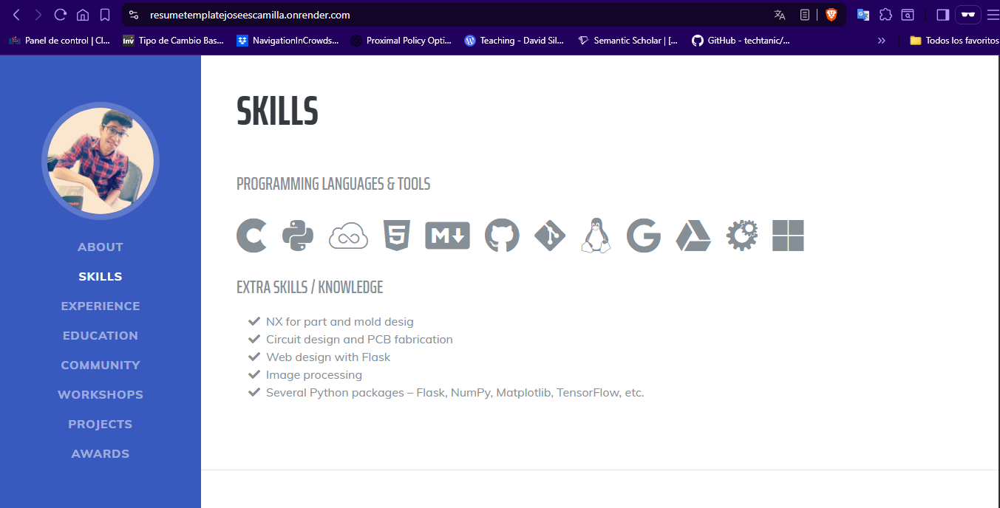
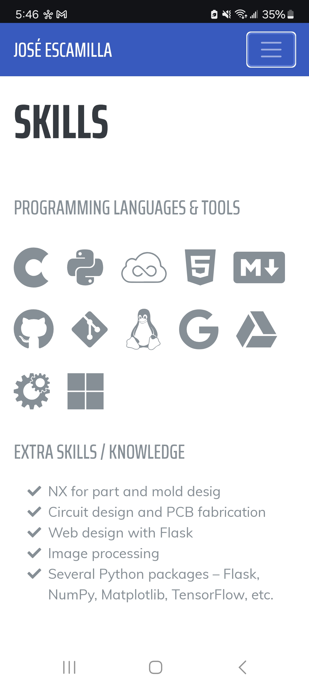

# Flask Resume Template

A dynamic, responsive resume/CV web application built with Flask and Bootstrap that automatically generates a professional-looking resume from a simple YAML configuration file.

## 🚀 Live Demo

[View Live Resume](https://resumetemplatejoseescamilla.onrender.com) (Replace with your actual Render URL)

## 📋 Table of Contents

- [Overview](#overview)
- [Features](#features)
- [Installation](#installation)
- [Usage](#usage)
- [Configuration](#configuration)
- [Deployment](#deployment)
- [Screenshots](#screenshots)
- [Problem & Solution](#problem--solution)
- [Future Improvements](#future-improvements)
- [Contributing](#contributing)
- [License](#license)

## 🎯 Overview

This Flask Resume Template is a web-based resume generator that transforms structured data from a YAML configuration file into a beautiful, responsive resume website. It's designed for developers, engineers, and professionals who want to maintain their resume as code while having a professional web presence.

## ✨ Features

- **📱 Responsive Design**: Works seamlessly on desktop, tablet, and mobile devices
- **⚡ Dynamic Content**: Resume content is managed through a simple YAML file
- **🎨 Modern UI**: Clean, professional design based on Bootstrap
- **🔧 Easy Customization**: Modify colors, fonts, and layout without touching HTML
- **📊 Structured Data**: Organized sections for experience, education, skills, and projects
- **🌐 Web Deployment**: Ready for deployment on platforms like Render, Heroku, or Vercel
- **🔗 Social Links**: Integration with LinkedIn, GitHub, and other professional platforms
- **📈 Project Showcase**: Dedicated section for highlighting your best work

## 🛠️ Installation

### Prerequisites

- Python 3.8 or higher
- pip (Python package manager)
- Git

### Local Setup

1. **Clone the repository**
   ```bash
   git clone https://github.com/your-username/Flask-Resume-Template.git
   cd Flask-Resume-Template
   ```

2. **Create a virtual environment** (recommended)
   ```bash
   python -m venv resume_env
   
   # On Windows
   resume_env\Scripts\activate
   
   # On macOS/Linux
   source resume_env/bin/activate
   ```

3. **Install dependencies**
   ```bash
   pip install -r requirements.txt
   ```

4. **Run the application**
   ```bash
   python app.py
   ```

5. **Open your browser** and navigate to `http://localhost:5000`

## 🎮 Usage

### Running Locally

```bash
python app.py
```

The application will start on `http://localhost:5000`

### Customizing Your Resume

1. Edit the `_config.yaml` file with your personal information
2. Save the file
3. Refresh your browser to see the changes

## 📁 Project Structure

```bash
Flask-Resume-Template/
├── app.py                           # Main Flask application
├── requirements.txt                 # Python dependencies
├── runtime.txt                      # Python version specification for deployment
├── Procfile                         # Deployment configuration for Render/Heroku
├── _config.yaml                     # Resume content configuration (YAML format)
├── start.sh                         # Shell script for local development
├── LICENSE                          # MIT License
├── README.md                        # Project documentation
├── assets/                          # Only images used in the README
├── static/                          # Static assets (CSS, JS, images)
│   ├── css/
│   │   └── resume.css               # Custom styles for the resume
│   ├── img/                         # Project images and personal photos
│   │   ├── jose.gif                 # Profile picture
│   │   ├── resume.png               # Resume project screenshot
│   │   ├── arduinopage.png          # Arduino course project image
│   │   ├── comparativeanalysis.png  # Data analysis project image
│   │   ├── covidcases.png           # COVID analysis project image
│   │   ├── covidprediction.png      # COVID prediction project image
│   │   ├── gameoflive.png           # Game of Life project image
│   │   ├── internship.png           # Internship project image
│   │   ├── irisflower.png           # Iris flower ML project image
│   │   ├── nxcourse.png             # NX course certificate image
│   │   └── scihub.png               # Sci-Hub extension project image
│   ├── js/
│   │   ├── resume.js                # Custom JavaScript functionality
│   │   └── resume.min.js            # Minified JavaScript
│   ├── vendor/                      # Third-party libraries
│   │   ├── bootstrap/               # Bootstrap CSS/JS framework
│   │   │   ├── css/                 # Bootstrap stylesheets
│   │   │   └── js/                  # Bootstrap JavaScript files
│   │   ├── fontawesome-free/        # Font Awesome icons
│   │   │   ├── css/                 # Font Awesome stylesheets
│   │   │   └── webfonts/            # Font Awesome web fonts
│   │   ├── jquery/                  # jQuery library
│   │   └── jquery-easing/           # jQuery easing animations
│   └── gulpfile.js                  # Gulp build configuration
├── templates/                       # Jinja2 HTML templates
│   └── index.html                   # Main resume template
└── __pycache__/                     # Python bytecode cache (auto-generated)
```

### Key Files Explained

| File/Directory | Purpose |
|---|---|
| `app.py` | Main Flask application with routing and YAML processing |
| `_config.yaml` | **Most important file** - Contains all resume content |
| `templates/index.html` | HTML template that renders the resume |
| `static/css/resume.css` | Custom styling for the resume layout |
| `static/img/` | Project screenshots and personal photos |
| `requirements.txt` | Python dependencies for production deployment |
| `Procfile` | Tells Render/Heroku how to run the application |
| `runtime.txt` | Specifies Python version for deployment |

## ⚙️ Configuration

The entire resume content is managed through the `_config.yaml` file. Here's the structure:

```yaml
# Personal Information
profile:
  first_name: Your Name
  last_name: Last Name
  email: your.email@example.com
  # ... more fields

# Work Experience
experience:
  item0:
    position: Your Job Title
    company: Company Name
    from: Start Date
    to: End Date
    description: >
      Your job description here...
    link: https://company-website.com

# Education
education:
  item0:
    institution: University Name
    program: Degree Program
    # ... more fields

# Skills and Tools
tools:
  - python
  - javascript
  - git
  # ... more skills

# Projects
projects:
  item1:
    title: Project Name
    subtitle: Brief description
    description: Detailed project description
    link: https://project-demo.com
    github: https://github.com/username/project
    # ... more fields
```

## 🚀 Deployment

### Deploy to Render

1. **Push your code to GitHub**
   ```bash
   git add .
   git commit -m "Initial commit"
   git push origin main
   ```

2. **Connect to Render**
   - Go to [Render.com](https://render.com)
   - Create a new Web Service
   - Connect your GitHub repository

3. **Configure the service**
   - **Build Command**: `pip install -r requirements.txt`
   - **Start Command**: `gunicorn app:app`
   - **Environment**: Python 3

4. **Deploy**
   - Click "Create Web Service"
   - Wait for deployment to complete

### Deploy to Other Platforms

- **Heroku**: Use the included `Procfile`
- **Vercel**: Configure for Python runtime
- **PythonAnywhere**: Upload files and configure WSGI

## 📸 Screenshots

*Add screenshots of your resume in action here*


<p align="center">  </p> <p align="center">  </p>

## 🎯 Problem & Solution

### The Problem

Maintaining a professional resume presents several challenges:

1. **Version Control**: Traditional resume formats (Word, PDF) are difficult to version control
2. **Consistency**: Keeping multiple formats (web, PDF, print) synchronized
3. **Accessibility**: Static PDFs aren't accessible or responsive
4. **Updates**: Making changes requires design software and manual reformatting
5. **Web Presence**: Need both a downloadable resume and professional website

### My Approach

I approached this problem by treating resume content as structured data:

1. **Separation of Concerns**: Content (YAML) separated from presentation (HTML/CSS)
2. **Version Control**: Everything stored in Git for full change tracking
3. **Automation**: Flask renders content dynamically, ensuring consistency
4. **Responsive Design**: Bootstrap ensures mobile-friendly presentation
5. **Developer-Friendly**: YAML format is easy to read and maintain

### The Solution

This Flask application provides:

- **Single Source of Truth**: All resume data in one YAML file
- **Automatic Generation**: Flask template engine creates beautiful HTML
- **Responsive Design**: Works on all devices automatically
- **Easy Deployment**: Ready for modern hosting platforms
- **Professional Output**: Clean, modern design suitable for any industry

### Technical Decision Process

1. **Framework Choice**: Flask chosen for simplicity and rapid development
2. **Data Format**: YAML selected for human readability and structure
3. **Templating**: Jinja2 provides powerful template inheritance
4. **Styling**: Bootstrap ensures professional appearance and responsiveness
5. **Deployment**: Gunicorn + Render for reliable, scalable hosting

## 🔮 Future Improvements

### Planned Features

- [ ] **PDF Export**: Generate PDF version directly from web interface
- [ ] **Theme System**: Multiple color schemes and layouts
- [ ] **Admin Panel**: Web-based editor for YAML configuration
- [ ] **Analytics**: Track resume views and engagement
- [ ] **Multi-language**: Support for multiple language versions
- [ ] **SEO Optimization**: Enhanced meta tags and structured data
- [ ] **Print Optimization**: Better print stylesheet
- [ ] **Contact Form**: Direct contact functionality

### Technical Enhancements

- [ ] **Caching**: Redis caching for improved performance
- [ ] **Testing**: Comprehensive test suite
- [ ] **CI/CD**: Automated testing and deployment
- [ ] **Docker**: Containerized deployment option
- [ ] **API**: REST API for external integrations

### Known Limitations

- Currently supports only one language at a time
- No built-in PDF generation
- Limited customization without code changes
- No user authentication system

## 🤝 Contributing

Contributions are welcome! Please feel free to submit a Pull Request.

1. Fork the repository
2. Create your feature branch (`git checkout -b feature/AmazingFeature`)
3. Commit your changes (`git commit -m 'Add some AmazingFeature'`)
4. Push to the branch (`git push origin feature/AmazingFeature`)
5. Open a Pull Request

## 📄 License

This project is licensed under the MIT License - see the [LICENSE](LICENSE) file for details.

## 🙏 Acknowledgments

- Design inspiration from [Start Bootstrap Resume Theme](https://startbootstrap.com/themes/resume/)
- Built with [Flask](https://flask.palletsprojects.com/)
- Styled with [Bootstrap](https://getbootstrap.com/)
- Icons from [Font Awesome](https://fontawesome.com/)

---

**Made with ❤️ by José Escamilla**

*If you found this project helpful, please give it a ⭐ on GitHub!*
